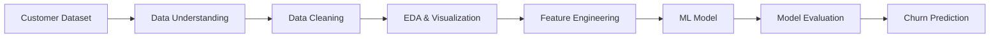

# 📊 Data Partner — Customer Churn Analysis

**End-to-End Customer Data Analysis & Churn Prediction**  
Explore • Prepare • Model • Evaluate


---

## 📌 Overview

**Data Partner** is a practical data-analysis project focused on **customer churn prediction**.

The project follows a structured workflow: understanding the dataset, cleaning data, exploring patterns, preparing features, building a classification model, and evaluating predictions.

### 🎯 Objective

Predict whether a customer is likely to churn:

```text
0 → No Churn
1 → Churn
```

---


## ✨ Features

- 🧹 Data cleaning and preprocessing
- 🔍 Dataset understanding
- 📊 Exploratory Data Analysis
- 📈 Data visualization
- ⚙️ Feature preparation
- 🤖 Customer churn classification
- 📏 Model evaluation
- 📋 Dataset profiling

---


## 🏗️ Project Workflow




---


## 📂 Project Structure

```text
Data-Partner/
│
├── data/
│   └── customer_data.csv
│
├── notebooks/
│   └── data_analysis.ipynb
│
├── reports/
│   └── profiling_report.html
│
├── outputs/
│   └── figures/
│
├── requirements.txt
└── README.md
```

> Adjust filenames if the repository uses different names.

---


## 🛠️ Technologies


| Technology          | Purpose                             |
| ------------------- | ----------------------------------- |
| 🐍 Python           | Core programming and analysis       |
| 🐼 Pandas           | Data manipulation and preprocessing |
| 🔢 NumPy            | Numerical operations                |
| 📊 Matplotlib       | Data visualization                  |
| 🎨 Seaborn          | Statistical visualization           |
| 🤖 Scikit-learn     | Machine-learning workflow           |
| 📓 Jupyter Notebook | Interactive development             |


---


## ⚙️ How It Works

```text
Customer Data
     ↓
Data Understanding
     ↓
Data Cleaning
     ↓
EDA & Visualization
     ↓
Feature Preparation
     ↓
Machine Learning
     ↓
Evaluation
     ↓
Churn Prediction
```


### Main stages

1. **Data Collection** — Load customer information.
2. **Data Preparation** — Inspect and clean the dataset.
3. **Exploration** — Study customer behaviour and patterns.
4. **Feature Preparation** — Prepare relevant model inputs.
5. **Prediction** — Perform churn classification.
6. **Evaluation** — Measure model performance.

---


## 🗃️ Dataset

The project works with customer attributes including:


| Feature     | Description                   |
| ----------- | ----------------------------- |
| `Age`       | Customer age                  |
| `Gender`    | Customer category             |
| `Income`    | Customer income               |
| `Purchases` | Customer purchase information |
| `Churn`     | Target variable               |


### Target

```text
Churn = 0 → No Churn
Churn = 1 → Churn
```

---


## 🚀 Installation


### Clone the repository

```bash
git clone <repository-url>
cd Data-Partner
```


### Install dependencies

```bash
pip install -r requirements.txt
```


### Start Jupyter

```bash
jupyter notebook
```

Open the project notebook and run the cells in sequence.

---


## ▶️ Usage

1. Place the dataset inside `data/`.
2. Open the analysis notebook.
3. Run the cleaning and EDA sections.
4. Review the visualizations.
5. Run the machine-learning section.
6. Review predictions and evaluation results.

---


## 🖼️ Screenshots / Demo


----------------------------------------------


## 🧩 Core Components


| Component           | Role                              |
| ------------------- | --------------------------------- |
| Dataset             | Customer information              |
| Data Cleaning       | Data quality and preparation      |
| EDA                 | Pattern and relationship analysis |
| Feature Engineering | Model input preparation           |
| ML Model            | Churn classification              |
| Evaluation          | Prediction assessment             |
| Profiling Report    | Dataset overview                  |


---


## 💡 Key Capabilities

The project enables users to:

- Understand customer data before modelling
- Explore patterns associated with churn
- Prepare raw data for machine learning
- Perform binary classification
- Evaluate a churn-prediction workflow
- Follow a complete data-analysis process

---


## 🔮 Future Improvements

- Compare multiple classification algorithms
- Improve feature engineering
- Add a prediction interface
- Include additional customer attributes
- Add stronger validation and evaluation
- Deploy the prediction workflow as an application

---


## 👨‍💻 Author

**Prince**

*AI & Data Science Student*

`Python` • `Data Analysis` • `Machine Learning`

---


## ⭐ Support

If you find this project useful, consider giving the repository a ⭐ on GitHub.

**📊 Data Partner**  
Turning customer data into useful predictions.
