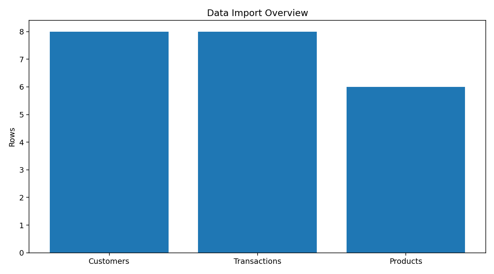
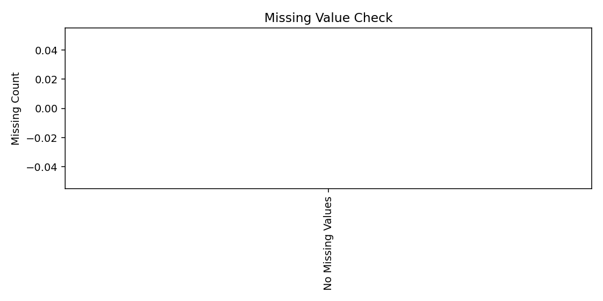
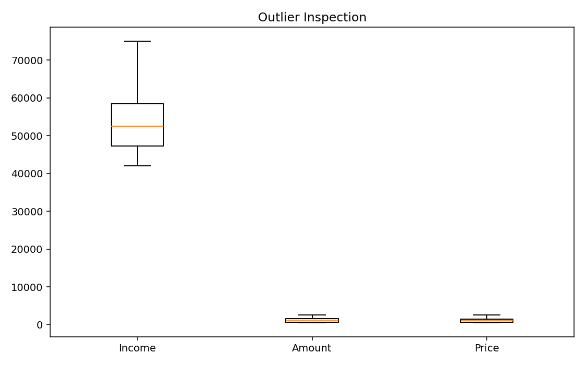
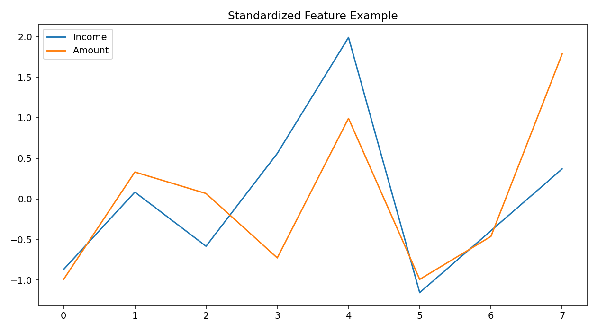
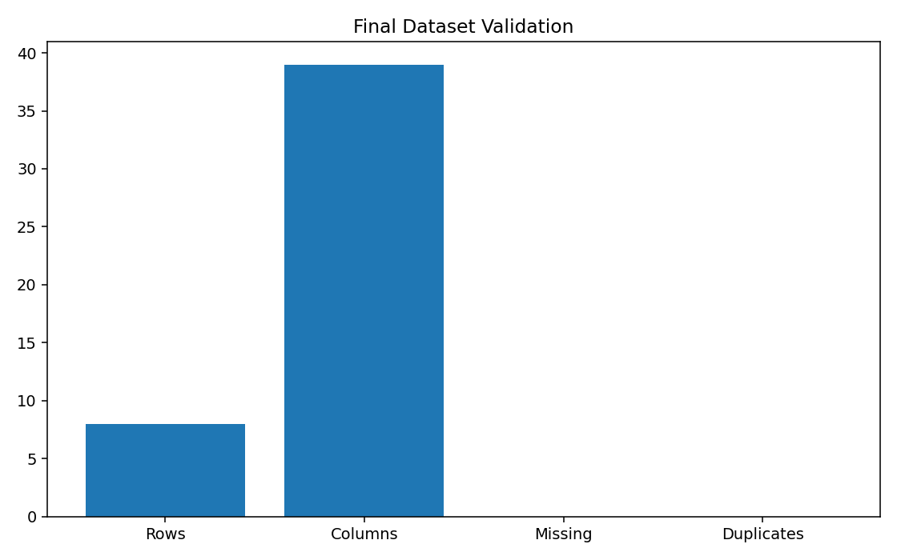

# Data Preprocessing & Feature Engineering

<p align="center">


</p>

<p align="center">


</p>

---

## 📌 Project Overview

A practical **Data Preprocessing and Feature Engineering** project covering the topics taught in the course from data analysis and data cleaning through feature transformation and construction.

The project uses practical Python implementations for working with structured data, missing values, outliers, categorical variables, numerical features, scaling and transformations.

---

## 🎯 Objectives

- Load data from CSV, Excel, JSON and SQL sources
- Fetch data from an API
- Understand and clean datasets
- Perform exploratory data analysis
- Handle missing values
- Detect and treat outliers
- Handle date/time and mixed variables
- Encode categorical variables
- Encode numerical features
- Apply feature scaling
- Construct and transform features
- Use `FunctionTransformer`
- Use `PowerTransformer`
- Apply `ColumnTransformer`
- Export the final processed dataset

---

## 📚 Course Topics Covered

### 1. Data Analysis
- Data Analysis
- Data Science Project Planning
- Framing a Machine Learning Problem
- Tensors
- Tensor in-depth concepts

### 2. Working With Data
- CSV files
- JSON
- SQL
- API data
- Data understanding
- Data cleaning

### 3. Exploratory Data Analysis
- Univariate Analysis
- Bivariate Analysis
- Multivariate Analysis
- Pandas Profiling

### 4. Missing Value Imputation
- Simple Imputer
- Numerical missing-value handling
- Categorical missing-value handling
- Most Frequent Imputation
- Missing Indicator
- Random Sample Imputation
- KNN Imputer
- MICE

### 5. Outlier Handling
- Z-score
- IQR
- Percentile Method
- Winsorization

### 6. Feature Transformation & Construction
- Mixed Variables
- Date and Time Variables
- Complete Case Analysis
- Ordinal Encoding
- Label Encoding
- One-Hot Encoding
- Binning / Discretization
- Binarization
- Quantile Binning
- K-Means Binning
- Standardization
- Normalization
- MinMax Scaling
- MaxAbs Scaling
- Robust Scaling
- Feature Construction & Splitting
- Log Transformation
- Reciprocal Transformation
- Square Root Transformation
- Box-Cox Transformation
- Yeo-Johnson Transformation
- Column Transformer

---

## 🛠️ Technologies

<p align="center">


</p>

---

## 📂 Project Structure

```text
Practicle DPP&FE/
│
├── Dataset/
│   ├── customers.xlsx
│   ├── transactions.json
│   └── products.sql
│
├── Notebook/
│   ├── DataPreprocessing.ipynb
│   └── DataPreprocessing_Updated.ipynb
│
├── Final Dataset/
│   └── processed_customer_data.csv
│
├── Screenshots/
│   ├── 01_data_import.png
│   ├── 02_eda_correlation.png
│   ├── 03_missing_data.png
│   ├── 04_outliers.png
│   ├── 05_scaling.png
│   └── 06_final_validation.png
│
├── requirements.txt
├── Summary_Report.md
└── README.md
```

---

## 🔄 Workflow

```text
Data Sources
     ↓
Data Understanding
     ↓
Data Cleaning
     ↓
EDA
     ↓
Missing Value Handling
     ↓
Outlier Detection
     ↓
Encoding
     ↓
Numerical Feature Encoding
     ↓
Feature Scaling
     ↓
Feature Construction
     ↓
Feature Transformation
     ↓
ColumnTransformer
     ↓
Final Validation
     ↓
Processed CSV
```

---

## 📊 Practical Implementation

### Data Import
Excel, JSON, SQL and API data are loaded and inspected using Python.

### EDA
The project performs univariate, bivariate and multivariate analysis using Pandas, Matplotlib and Seaborn.

### Missing Values
Different imputation approaches from the syllabus are implemented and compared where applicable.

### Outliers
Z-score, IQR, percentile and Winsorization techniques are demonstrated.

### Encoding
Categorical and numerical feature encoding techniques from the syllabus are implemented.

### Scaling
Standardization, normalization, MinMax, MaxAbs and Robust scaling are demonstrated.

### Transformation
`FunctionTransformer` is used for log, reciprocal and square-root transformations. `PowerTransformer` is used for Box-Cox and Yeo-Johnson transformations.

---

## 🖼️ Screenshots

### Data Import


### EDA


### Missing Values


### Outliers


### Feature Scaling


### Final Validation


---

## ⚙️ Installation

Install the required packages:

```bash
pip install -r requirements.txt
```

For Python 3.14:

```bash
py -3.14 -m pip install -r requirements.txt
```

---

## ▶️ Run the Project

1. Open the project folder in VS Code.
2. Open `Notebook/DataPreprocessing_Updated.ipynb`.
3. Select the Python environment where the requirements are installed.
4. Run the notebook from top to bottom.
5. Check the processed dataset in `Final Dataset/`.

---

## 📤 Output

The final processed dataset is:

```text
Final Dataset/processed_customer_data.csv
```

---

## ✅ Project Status

<p align="center">


</p>

---

## 👨‍💻 Project

**Data Preprocessing & Feature Engineering Practical**

Built as a course practical covering the taught data analysis, data cleaning, and feature transformation topics.
